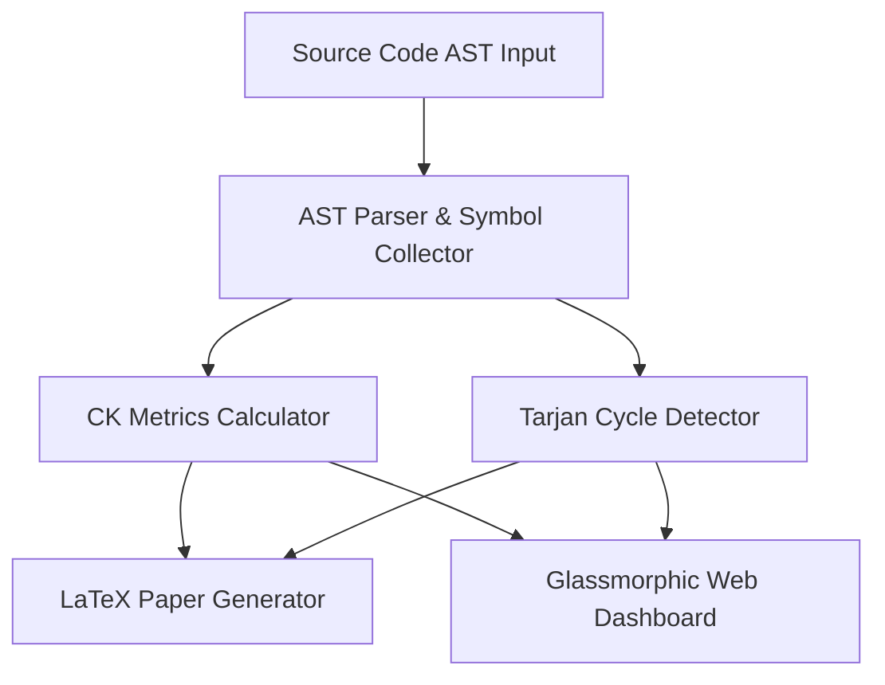

# AST Architecture Analytics & Static Metrics Engine 📐 🔬

[](https://opensource.org/licenses/MIT)
[](https://www.typescriptlang.org/)
[](https://nodejs.org/)

**Author:** anderdebona (Department of Computer Science & Software Engineering)

---

## 📌 Executive Summary & Academic Purpose

This repository implements a **PhD-grade Static Code Analysis and Architectural Software Metrics Engine**. It parses Abstract Syntax Trees (ASTs) of target TypeScript/JavaScript codebases, computes object-oriented metrics based on the **Chidamber & Kemerer (CK) Metric Suite**, identifies architectural cohesion degradation via **Henderson-Sellers LCOM4 topological graphs**, detects circular dependencies using **Tarjan's Strongly Connected Components (SCC) algorithm**, and automatically outputs publication-ready $\LaTeX$ reports formatted according to IEEE/ACM standards.

---

## 🏛️ Architecture Overview & C4 Model



---

## 📐 Mathematical Metrics Formulations

### 1. Lack of Cohesion in Methods ($LCOM4$)
For a class $C$ with method set $M = \{m_1, m_2, \dots, m_n\}$ and attribute set $A = \{a_1, a_2, \dots, a_k\}$, graph $G = (M, E)$ is constructed where:
$$(m_i, m_j) \in E \iff \text{Access}(m_i) \cap \text{Access}(m_j) \neq \emptyset$$
$$LCOM4(C) = |\text{ConnectedComponents}(G)|$$

* **$LCOM4 = 1$**: High structural cohesion (Single Responsibility Principle compliant).
* **$LCOM4 \ge 2$**: Structural fragmentation; class is a candidate for decomposition into distinct microservices/classes.

### 2. McCabe Cyclomatic Complexity ($V(G)$)
For a Control Flow Graph $CFG = (V, E, P)$:
$$V(G) = E - V + 2P$$

---

## 🚀 Quickstart & Installation

```bash
# Clone the repository
git clone https://github.com/anderdebona/arch-analyzer-ast-engine.git
cd arch-analyzer-ast-engine

# Install dependencies
npm install

# Build & Run in Development Mode
npm run dev
```

Visit the interactive Web Dashboard at: **`http://localhost:3001`**

---

## 🧪 Automated Testing

```bash
# Run unit and integration tests via Vitest
npm test
```

---

## 📜 Citation & License

```bibtex
@software{debona2026ast,
  author = {anderdebona},
  title = {AST Architecture Analytics \& Static Metrics Engine},
  year = {2026},
  publisher = {GitHub},
  journal = {GitHub Repository},
  howpublished = {\url{https://github.com/anderdebona/arch-analyzer-ast-engine}}
}
```

Licensed under the MIT License.
