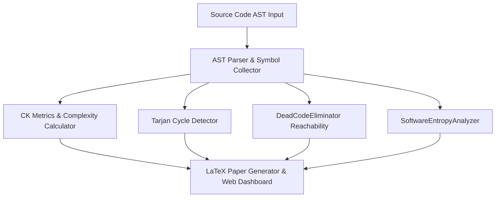

# AST Architecture Analytics & Static Metrics Engine 📐 🔬

<div align="center">

[](https://opensource.org/licenses/MIT)
[](https://www.typescriptlang.org/)
[](https://github.com/anderdebona/arch-analyzer-ast-engine)
[](https://github.com/anderdebona/arch-analyzer-ast-engine/actions)

<br />

**PhD-Grade Static Code Analysis, CK Metrics Suite, Tarjan Cycles, Dead Code Eliminator & Software Entropy Analyzer**

*Engineered by **[anderdebona](https://github.com/anderdebona)***

</div>

---

## 📌 Executive Summary & Academic Purpose

This repository implements a **PhD-grade Static Code Analysis and Architectural Software Metrics Engine**. It parses Abstract Syntax Trees (ASTs) of target TypeScript/JavaScript codebases, computes object-oriented metrics based on the **Chidamber & Kemerer (CK) Metric Suite**, identifies architectural cohesion degradation via **Henderson-Sellers LCOM4 topological graphs**, detects circular dependencies using **Tarjan's Strongly Connected Components (SCC) algorithm**, eliminates unreferenced symbols with **DeadCodeEliminator**, and measures Shannon software entropy and Martin instability.

---

## 🔬 Mathematical Formulations

### 1. Lack of Cohesion in Methods ($LCOM4$)
For a class $C$ with method set $M = \{m_1, m_2, \dots, m_n\}$ and attribute set $A = \{a_1, a_2, \dots, a_k\}$, graph $G = (M, E)$ is constructed where:
$$(m_i, m_j) \in E \iff \text{Access}(m_i) \cap \text{Access}(m_j) \neq \emptyset$$
$$LCOM4(C) = |\text{ConnectedComponents}(G)|$$

### 2. Software Shannon Token Entropy & Martin Instability
$$H(X) = -\sum_{i=1}^n p(x_i) \log_2 p(x_i), \qquad I = \frac{C_e}{C_a + C_e}$$

---

## 🏛️ System Architecture



---

## ⚡ What's New in v4.0.0

- 🧹 **`DeadCodeEliminator`**: Transitive reachability analysis from application entrypoints to eliminate dead exports and zombie code.
- 📉 **`SoftwareEntropyAnalyzer`**: Shannon token entropy computation and Martin package instability indices.
- 🔗 **`DependencyMapper`**: Inter-module import edge extraction and external package boundary detection.
- 🐙 **Production Matrix CI/CD**: Automated GitHub Actions testing across Node.js LTS versions.

---

## 🚀 Quickstart & Installation

```bash
# Clone the repository
git clone https://github.com/anderdebona/arch-analyzer-ast-engine.git
cd arch-analyzer-ast-engine

# Install dependencies
npm install

# Run automated tests
npm test

# Build & Run in Development Mode
npm run dev
```

Visit the interactive visual dashboard at: **`http://localhost:3008`**

---

## 🌟 Join the Community & Contribute

We actively invite static analysis researchers, compiler engineers, and software architects:
1. ⭐ **Star this repository** to support open-source architecture verification!
2. 🗺️ Check out the [ROADMAP.md](./ROADMAP.md) for upcoming Tree-Sitter & LLVM integration.
3. 💬 Propose metrics or AST rules via [GitHub Issues](https://github.com/anderdebona/arch-analyzer-ast-engine/issues).
4. 📜 Academic citation: see [CITATION.cff](./CITATION.cff).

---

<div align="center">

Distributed under the MIT License. Built with passion by **[anderdebona](https://github.com/anderdebona)**.

</div>
