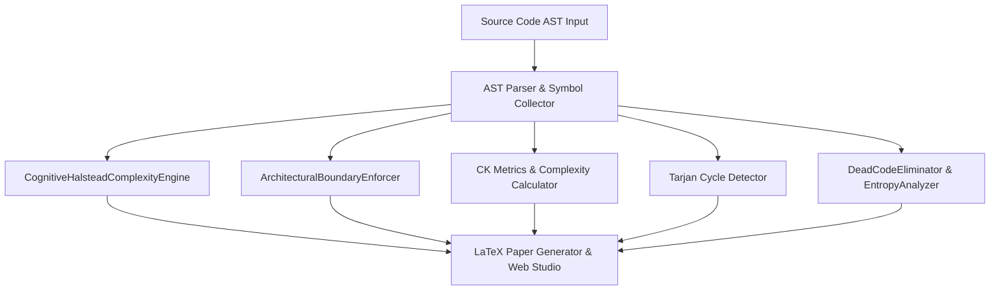

# AST Architecture Analytics & Static Metrics Engine 📐 🔬

<div align="center">

[](https://opensource.org/licenses/MIT)
[](https://www.typescriptlang.org/)
[](https://github.com/anderdebona/arch-analyzer-ast-engine)
[](https://github.com/anderdebona/arch-analyzer-ast-engine/actions)

<br />

**PhD-Grade Static Code Analysis, Cognitive Complexity, Halstead Metrics, Clean Architecture Boundary Enforcer, CK Metrics Suite & Shannon Software Entropy**

*Engineered with precision by **[anderdebona](https://github.com/anderdebona)***

</div>

---

## 📌 Executive Summary & Academic Purpose

This repository implements a **PhD-grade Static Code Analysis and Architectural Software Metrics Engine**. It parses Abstract Syntax Trees (ASTs) of target TypeScript/JavaScript codebases, computes cognitive complexity with nesting penalties, calculates Halstead Software Science metrics (Volume, Difficulty, Effort, Bug Estimation), enforces Clean & Hexagonal Architectural layer boundaries, calculates **Chidamber & Kemerer (CK) Metric Suite**, evaluates **LCOM4 topological graphs**, detects circular dependencies using **Tarjan's SCC algorithm**, and measures Shannon software entropy.

---

## 🔬 Mathematical Formulations

### 1. Halstead Software Science Metrics
Given $\eta_1$ distinct operators, $\eta_2$ distinct operands, $N_1$ total operators, $N_2$ total operands:
$$\text{Vocabulary } \eta = \eta_1 + \eta_2, \quad \text{Length } N = N_1 + N_2$$
$$\text{Volume } V = N \times \log_2(\eta), \quad \text{Difficulty } D = \left(\frac{\eta_1}{2}\right) \times \left(\frac{N_2}{\eta_2}\right)$$
$$\text{Effort } E = D \times V, \quad \text{Estimated Delivered Bugs } B = \frac{E^{2/3}}{3000}$$

### 2. Cognitive Complexity Metric
$$\text{CognitiveScore} = \sum_{i \in \text{constructs}} \left( 1 + \text{NestingLevel}(i) \right)$$

### 3. Lack of Cohesion in Methods ($LCOM4$)
For class $C$ with method set $M = \{m_1, \dots, m_n\}$ and attribute set $A = \{a_1, \dots, a_k\}$:
$$(m_i, m_j) \in E \iff \text{Access}(m_i) \cap \text{Access}(m_j) \neq \emptyset \implies LCOM4(C) = |\text{ConnectedComponents}(G)|$$

---

## 🏛️ System Architecture



---

## ⚡ What's New in v5.0.0

- 🧠 **`CognitiveHalsteadComplexityEngine`**: Campbell Cognitive Complexity with nested penalty tracking + Halstead Software Science equations.
- 🛡️ **`ArchitecturalBoundaryEnforcer`**: Clean/Hexagonal Architecture layer boundary auditing to prevent domain contamination.
- 🚀 **Interactive Studio v5.0.0**: Real-time Cognitive Radar, Maintainability Index Gauge, and Architecture Compliance audit.
- 📊 **Exhaustive Unit Tests**: 14/14 passing Vitest tests validating metrics, boundaries, cycles, and entropy.

---

## 🚀 Quickstart & Interactive Studio

```bash
# Clone and install dependencies
git clone https://github.com/anderdebona/arch-analyzer-ast-engine.git
cd arch-analyzer-ast-engine
npm install

# Run Vitest test suite
npm test

# Build & launch interactive UI Studio
npm run build
npm start
# Navigate to http://localhost:3001
```

---

## 📄 License & Citation
MIT License © 2026 anderdebona. See [CITATION.cff](CITATION.cff) for academic attribution.
